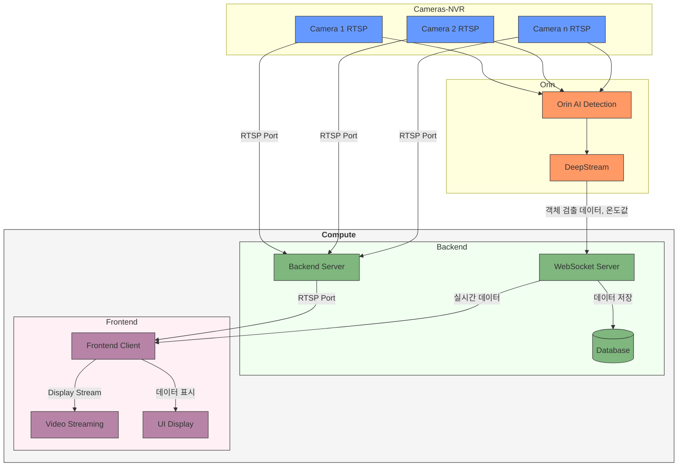
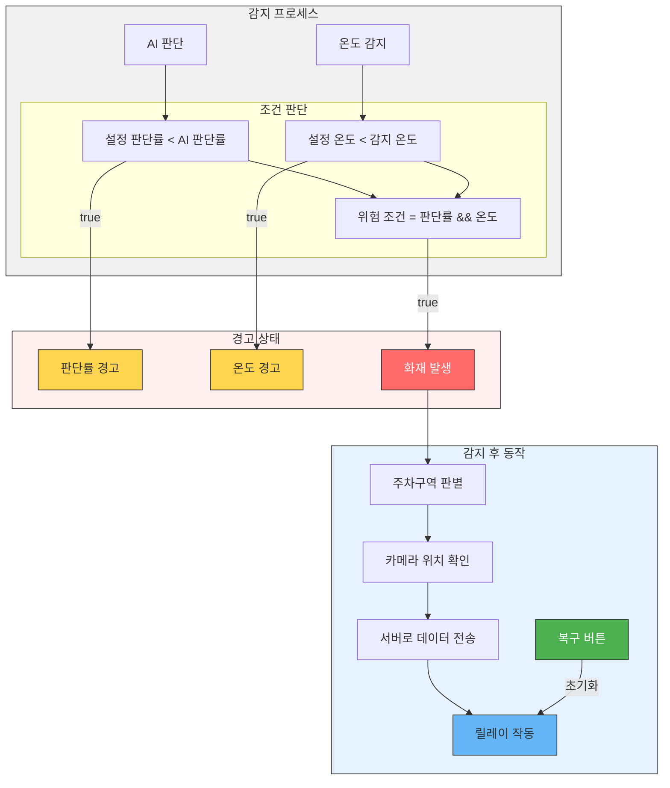

# 프로젝트 초기 세팅

- Next.js
- Tailwind CSS
- TypeScript
- Shadcn UI

# 네이밍 컨벤션

###### 카멜케이스 / 상수 => 스네이크케이스

###### page.tsx, layout.tsx

- export default function Home() {}
- export default function OOOPage() {}

###### page.tsx, layout.tsx 외 components

- export const ComponentName: FC = () => {}

---

# 데이터 흐름도

# process

---

### This project

###### 프로젝트 소개

- 리조트 관리 시스템을 위한 웹 애플리케이션.

- 사용자에게 시각적으로 정보를 제공하여 리조트의 안전과 효율적인 운영을 지원
- 리조트의 안전과 운영 효율성을 높이기 위해 설계
- 사용자에게 직관적이고 실시간으로 정보를 제공하는 것을 목표

---

### 주요 기능 및 핵심 기술 구현사항

1. 실시간 CCTV 모니터링

   - WebSocket을 통한 실시간 CCTV 영상 스트리밍
   - 카메라의 경고 상태에 따라 UI에 경고 표시
   - 사용자 설정에 따라 카메라의 위치와 이름을 직접 편집 가능

2. 알람 시스템

   - Web Audio API를 활용한 커스텀 알람 소리 재생
   - 온도 및 AI 판단 결과에 따라 경고 발생
   - 사용자 설정 기반 알람 동작 제어 및 다중 알람 상태 관리

3. 데이터 시각화 및 로그 관리

   - Recharts를 활용한 실시간 데이터 차트
   - 카메라에서 수집된 로그 데이터를 테이블 형식으로 시각화
   - 화재 및 연기 감지 데이터를 시각화하여 차트로 제공
   - 로그 데이터를 엑셀 파일로 다운로드 가능

4. 사용자 설정 및 보안 기능
   - 카메라 위치와 이름, 알람 소리 및 알람 바 설정
   - 판단률 및 온도 설정
   - 토큰 기반 인증 시스템을 통한 보안 강화
   - 세션 관리 및 자동 로그아웃 기능

###### 기술 스택

- 프론트엔드: Next.js, TypeScript, Tailwind CSS, Shadcn UI
- 기타: Socket.io를 사용하여 실시간 데이터 전송 및 WebSocket 연결을 관리

###### 코드 구조

1. src/app/components
   - UI 컴포넌트들이 위치한 디렉토리로, 각 페이지에 필요한 다양한 컴포넌트들이 포함
2. src/utils
   - 데이터 처리 및 API 호출을 위한 유틸리티 함수들이 포함
3. src/types
   - TypeScript 타입 정의 파일들이 포함
